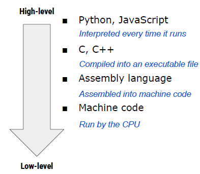
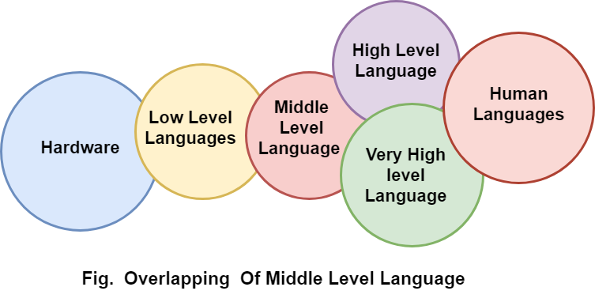

# Some remarks
- There are multiple kinds of programming languages.
- Some are easy to read, some are not.
- Some are fast, some are slow.
- Some people preach A and hate B, and viceversa. Why?
- But in general, the principles of programming are the same*.

*debatable for other paradigms.

## The languages I showed you:

## In general, the highest level is human language:

### Usually, programming languages are made of sentences. Why?
